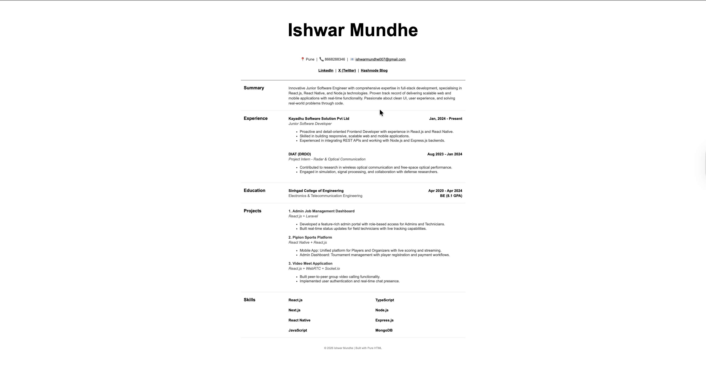

# HTML-Only Resume Website

A clean, responsive single-page resume built entirely using **HTML5** without any CSS or JavaScript. This project demonstrates the power of semantic HTML tags, table-based layouts, and legacy attributes to create a structured document.

🔗 **Live Demo:** [Click here to view the Resume](#) _(Replace with your GitHub Pages link)_

## 📸 Screenshots

|           Desktop View            |
| :-------------------------------: |
|  |

_(Add a screenshot named screenshot.png to your repo folder)_

## 🚀 Features

- **Pure HTML:** No external or internal CSS used.
- **Table Layout:** Uses nested tables for alignment and structure.
- **Semantic Structure:** Includes Headers, Lists, and Sections.
- **Visual Clarity:** Replicates a professional resume design with precise spacing.

## 🛠️ Setup & Usage

1. **Clone the repository:**
   ```bash
   git clone [git@github.com:ishwarmundhe/Cohort_assignment_1.git](git@github.com:ishwarmundhe/Cohort_assignment_1.git)
   ```
